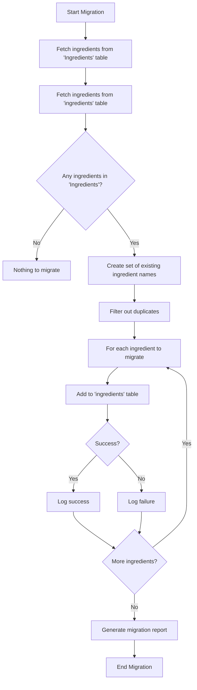

# Ingredients Table Fix Documentation

## Issue Description

The DIY Recipes application encountered an issue with inconsistent table name references in the database. The application was using two separate tables to store ingredients:

1. A capitalized `Ingredients` table
2. A lowercase `ingredients` table

This inconsistency in table naming caused confusion in the codebase, with some parts of the application referencing the capitalized table and others referencing the lowercase table. The primary issue was that the UI components were only fetching ingredients from the lowercase `ingredients` table, as seen in the `api.js` file:

```javascript
export async function loadAllIngredients() {
  try {
    const { data, error } = await supabaseClient
      .from('ingredients')  // Note: lowercase table name
      .select('*')
      .order('name', { ascending: true })
      .limit(1000);
    // ...
  }
}
```

## Impact on the Application

This inconsistency had several negative impacts on the application:

1. **Missing Ingredients in Dropdown**: Ingredients stored in the capitalized `Ingredients` table were not appearing in the dropdown menu when users were creating or editing recipes.

2. **Confusing Developer Experience**: Developers working on the codebase had to remember which table was being used in different parts of the application.

3. **Data Fragmentation**: Ingredient data was split between two tables, making it difficult to maintain a complete list of available ingredients.

4. **Potential Data Integrity Issues**: The same ingredient could exist in both tables with different IDs, potentially causing data integrity problems.

## Solution Implemented

The solution was to standardize on a single table name throughout the application:

1. **Standardize on Lowercase**: The team decided to standardize on the lowercase `ingredients` table as the single source of truth for all ingredient data.

2. **Create Migration Scripts**: Two migration scripts were developed:
   - A browser-based script (`migrateIngredients.js`) for users to run through a web interface
   - A command-line script (`migrateIngredientsCmd.js`) for administrators to run directly

3. **Update Code References**: Ensure all code consistently references the lowercase `ingredients` table.

## Data Migration Approach

The migration process was designed to be safe, idempotent, and transparent:



The migration process follows these steps:

1. **Data Retrieval**: Fetch all ingredients from both the capitalized and lowercase tables.
   ```javascript
   const capitalizedIngredients = await loadCapitalizedIngredients();
   const lowercaseIngredients = await loadAllIngredients();
   ```

2. **Duplicate Detection**: Create a set of existing ingredient names in the lowercase table for quick lookup.
   ```javascript
   const existingIngredientNames = new Set(
     lowercaseIngredients.map(ing => ing.name.toLowerCase())
   );
   ```

3. **Filtering**: Filter out ingredients that already exist in the lowercase table to avoid duplicates.
   ```javascript
   const ingredientsToMigrate = capitalizedIngredients.filter(
     ing => !existingIngredientNames.has(ing.name.toLowerCase())
   );
   ```

4. **Migration**: Migrate each ingredient that doesn't already exist to the lowercase table.
   ```javascript
   for (const ingredient of ingredientsToMigrate) {
     const newIngredient = await addGlobalIngredient(ingredient.name);
     // Track success/failure...
   }
   ```

5. **Reporting**: Generate a detailed report of the migration results, including successes and failures.
   ```javascript
   console.log(`Total ingredients to migrate: ${migrationResults.total}`);
   console.log(`Successfully migrated: ${migrationResults.successful}`);
   console.log(`Failed to migrate: ${migrationResults.failed}`);
   ```

## Recommendations for Preventing Similar Issues

To prevent similar issues in the future, we recommend the following best practices:

### 1. Consistent Naming Conventions

- **Use Lowercase for Table Names**: Consistently use lowercase for all table names in the database.
- **Document Naming Conventions**: Clearly document naming conventions in a project style guide.
- **Use Linting Tools**: Implement linting tools that can detect inconsistent naming patterns.

### 2. Database Schema Management

- **Version Control for Schema**: Keep database schema under version control.
- **Use Migrations**: Implement a formal migration system for all database changes.
- **Schema Validation**: Add validation to ensure schema changes follow naming conventions.

### 3. Code Quality Practices

- **Code Reviews**: Ensure thorough code reviews that check for consistent database references.
- **Centralize Database Access**: Use a data access layer or repository pattern to centralize database access.
- **Use Constants for Table Names**: Define table names as constants in a single location:
  ```javascript
  // Example: Define table names as constants
  export const TABLES = {
    INGREDIENTS: 'ingredients',
    RECIPES: 'recipes',
    // ...
  };
  ```

### 4. Testing

- **Integration Tests**: Implement integration tests that verify database interactions.
- **Schema Tests**: Add tests that verify the database schema matches expectations.
- **UI Tests**: Test UI components to ensure they correctly display data from the database.

### 5. Documentation

- **Database Schema Documentation**: Maintain up-to-date documentation of the database schema.
- **API Documentation**: Document API endpoints and their database interactions.
- **Change Documentation**: Document all database changes, including the reasoning behind them.

By following these recommendations, the team can avoid similar issues in the future and maintain a more consistent and reliable codebase.