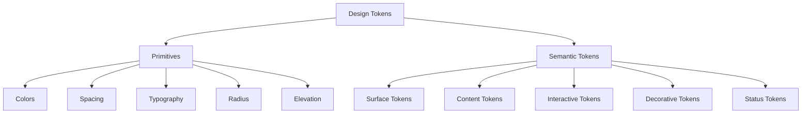
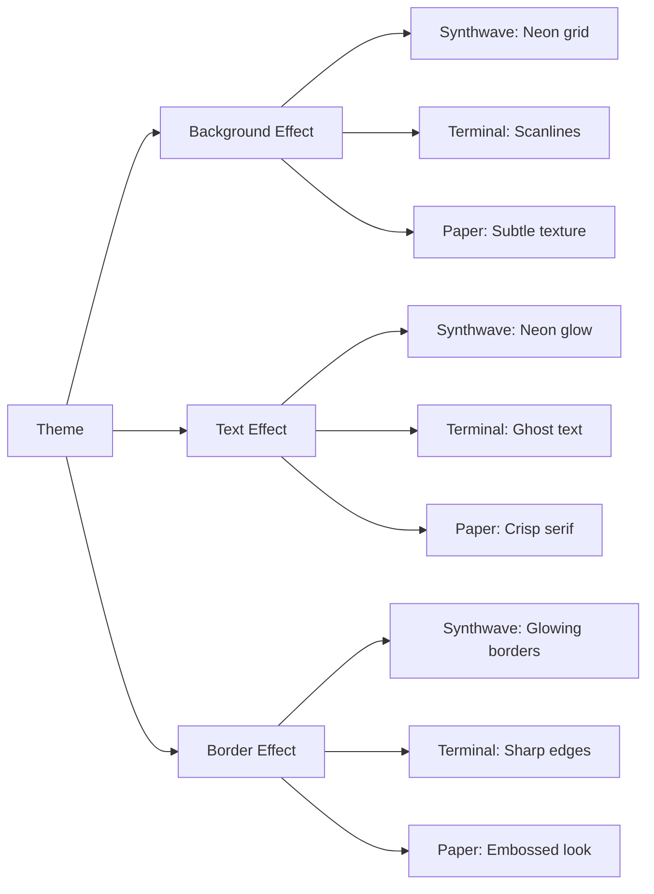
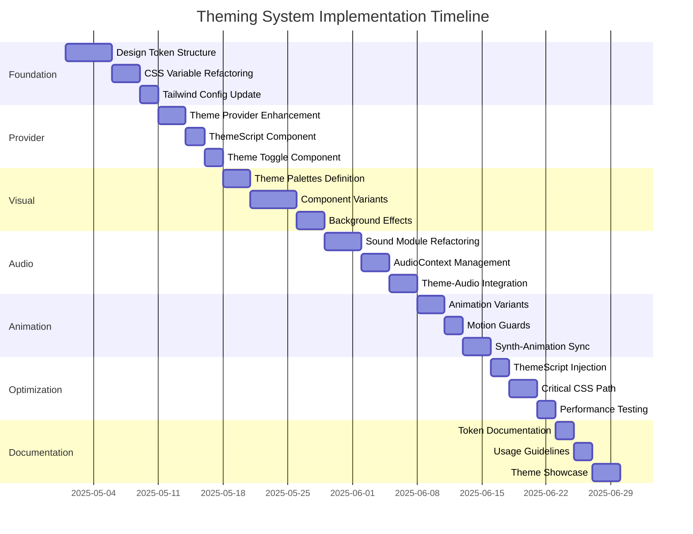

# Next.js Theming System Implementation Plan

Based on the research and current project structure, this document outlines a comprehensive implementation plan for upgrading the theming system in the DIY Recipes application.

## 1. Design Token Foundation (Week 1)

### 1.1 Create Token Taxonomy


### 1.2 Refactor CSS Variables Structure
- Create a new `tokens.css` file with the following structure:
  - Base primitive tokens (color, spacing, etc.)
  - Semantic tokens that map to primitives
  - Theme-specific mappings

### 1.3 Convert Color Values to RGB Triplets
- Update all color variables to use RGB triplet format
- Example:
  ```css
  /* Before */
  --accent: #00C8FF;
  
  /* After */
  --accent: 0 200 255; /* RGB triplet */
  ```

### 1.4 Update Tailwind Config
- Modify `tailwind.config.cjs` to use the new CSS variables
- Implement the `withOpacity` function to leverage RGB triplets

## 2. Theme Provider Enhancement (Week 2)

### 2.1 Update SettingsProvider
- Refactor theme options to match new themes:
  ```typescript
  type Theme = 'synthwave-noir' | 'terminal-mono' | 'paper-ledger';
  ```
- Add theme detection logic (OS preference, localStorage, cookies)
- Implement hydration guard for SSR

### 2.2 Create ThemeScript Component
- Implement inline script to prevent FOUC
- Add to root layout wrapped in Suspense

### 2.3 Enhance Theme Toggle Component
- Update UI to reflect new theme options
- Add keyboard shortcut (⌘/Ctrl + L)
- Implement smooth transition between themes

## 3. Visual Theme Implementation (Week 2-3)

### 3.1 Define Theme Palettes
- Implement the three hero palettes:
  - Synthwave Noir (dark, neon-focused)
  - Terminal Mono (green-amber on charcoal)
  - Paper Ledger (muted natural whites)

### 3.2 Create Theme-Specific Components
- Develop theme-specific variants for:
  - Buttons
  - Panels
  - Form elements
  - Typography

### 3.3 Implement Theme Background Effects


## 4. Audio Design System (Week 3-4)

### 4.1 Refactor Sound Module
- Update the existing sound system to use the synth-only approach
- Implement the synth patches from the research:
  - Button hover: Sine blip at 900 Hz
  - Button click: Plucky triangle 300→80 Hz
  - Modal open: Lush pad (saw + sine)
  - Success toast: Fifth interval arpeggio
  - Error toast: Noise burst filtered

### 4.2 Create AudioContext Management
- Implement proper AudioContext creation on user interaction
- Add volume control and muting capabilities
- Ensure proper cleanup of audio resources

### 4.3 Theme-Audio Integration
- Connect audio effects to theme selection
- Implement theme-specific sound variations

## 5. Animation System Enhancement (Week 4)

### 5.1 Define Animation Variants
- Create a set of reusable animation variants:
  - Page transitions
  - Scroll-trigger effects
  - Hover/focus states
  - Loading states

### 5.2 Implement Motion Guards
- Add `prefers-reduced-motion` detection
- Create fallback animations for reduced motion preference
- Ensure all animations can be disabled

### 5.3 Synth-Animation Synchronization
- Connect animation timings with audio envelopes
- Implement visual feedback for audio events

## 6. Edge-Safe SSR Optimization (Week 5)

### 6.1 Implement ThemeScript Injection
- Create script to detect and apply theme before hydration
- Add to document head or root layout

### 6.2 Optimize Critical CSS Path
- Extract and inline critical theme CSS
- Defer non-critical styles

### 6.3 Performance Testing
- Test hydration performance
- Measure and optimize CLS (Cumulative Layout Shift)
- Ensure smooth theme transitions

## 7. Documentation and Testing (Week 5-6)

### 7.1 Create Theme Documentation
- Document token system
- Create theme usage guidelines
- Document component theming API

### 7.2 Implement Theme Testing
- Create visual regression tests
- Test theme switching
- Test accessibility compliance

### 7.3 Create Theme Showcase
- Develop a theme demo page
- Show all components in all themes

## Implementation Timeline



## Key Files to Modify

1. `DIY_Recipes/providers/SettingsProvider.tsx`
2. `DIY_Recipes/app/globals.css`
3. `DIY_Recipes/tailwind.config.cjs`
4. `DIY_Recipes/components/SettingsOverlay.tsx`
5. `DIY_Recipes/lib/sound.ts`
6. `DIY_Recipes/app/layout.tsx`

## New Files to Create

1. `DIY_Recipes/styles/tokens.css`
2. `DIY_Recipes/components/ThemeScript.tsx`
3. `DIY_Recipes/lib/theme-utils.ts`
4. `DIY_Recipes/hooks/useTheme.ts`
5. `DIY_Recipes/components/ThemeDemo.tsx`

## Migration Strategy

To ensure a smooth transition:

1. **Parallel Implementation**: Build the new system alongside the existing one
2. **Component-by-Component Migration**: Gradually migrate components to use the new token system
3. **Theme Mapping**: Create a mapping between old and new theme names for backward compatibility
4. **Feature Flags**: Use feature flags to enable/disable new theming features
5. **A/B Testing**: Test new themes with a subset of users before full rollout

## Code Samples

### Example: tokens.css Structure

```css
/* Base primitive tokens */
:root {
  /* Colors (in RGB format for Tailwind opacity utilities) */
  --color-black: 0 0 0;
  --color-white: 255 255 255;
  --color-blue-500: 0 200 255;
  --color-pink-500: 255 0 255;
  --color-green-500: 0 224 80;
  --color-amber-500: 255 153 0;
  
  /* Spacing */
  --spacing-1: 0.25rem;
  --spacing-2: 0.5rem;
  --spacing-4: 1rem;
  --spacing-8: 2rem;
  
  /* Typography */
  --font-sans: 'Rajdhani', sans-serif;
  --font-mono: 'JetBrains Mono', monospace;
  --font-display: 'Orbitron', sans-serif;
}

/* Semantic tokens - Synthwave Noir (default) */
:root {
  /* Surface tokens */
  --surface-0: 60 25 300; /* oklch format */
  --surface-1: 50 23 300;
  --surface-inverse: 95 1 315;
  
  /* Content tokens */
  --text-primary: 95 1 315;
  --text-secondary: 85 5 310;
  --text-inverse: 60 25 300;
  
  /* Interactive tokens */
  --accent: 70 30 330;
  --accent-hover: 75 32 330;
  --accent-active: 60 28 330;
  
  /* Decorative tokens */
  --border-subtle: 70 15 320 / 0.3;
  --shadow-soft: 0 2px 6px 0 oklch(0 0 0 / 0.3);
  --glow-pulse: 0 0 10px oklch(70 30 330);
  
  /* Status tokens */
  --success: 80 20 140;
  --warning: 75 18 85;
  --error: 65 30 30;
}

/* Terminal Mono theme */
[data-theme="terminal-mono"] {
  /* Surface tokens */
  --surface-0: 10 2 280;
  --surface-1: 6 2 280;
  --surface-inverse: 85 1 100;
  
  /* Content tokens */
  --text-primary: 85 1 100;
  --text-secondary: 75 2 110;
  --text-inverse: 10 2 280;
  
  /* Interactive tokens */
  --accent: 65 18 90;
  --accent-hover: 70 20 90;
  --accent-active: 55 16 90;
  
  /* Decorative tokens */
  --border-subtle: 65 10 90 / 0.3;
  --shadow-soft: 0 2px 6px 0 oklch(0 0 0 / 0.3);
  --glow-pulse: 0 0 8px oklch(65 18 90);
  
  /* Status tokens */
  --success: 70 15 140;
  --warning: 70 20 85;
  --error: 60 25 30;
}

/* Paper Ledger theme */
[data-theme="paper-ledger"] {
  /* Surface tokens */
  --surface-0: 94 2 90;
  --surface-1: 90 2 90;
  --surface-inverse: 25 1 70;
  
  /* Content tokens */
  --text-primary: 25 1 70;
  --text-secondary: 40 2 75;
  --text-inverse: 94 2 90;
  
  /* Interactive tokens */
  --accent: 60 16 40;
  --accent-hover: 65 17 40;
  --accent-active: 55 15 40;
  
  /* Decorative tokens */
  --border-subtle: 60 8 40 / 0.2;
  --shadow-soft: 0 1px 3px 0 oklch(0 0 0 / 0.12);
  --glow-pulse: 0 0 5px oklch(60 16 40 / 0.5);
  
  /* Status tokens */
  --success: 65 15 140;
  --warning: 70 15 85;
  --error: 65 20 30;
}
```

### Example: Updated Tailwind Config

```typescript
// tailwind.config.ts
import type { Config } from 'tailwindcss'

const withOpacity = (variable: string) => 
  `oklch(var(${variable}) / <alpha-value>)`;

const config: Config = {
  content: [
    './app/**/*.{ts,tsx}',
    './components/**/*.{ts,tsx}',
  ],
  theme: {
    extend: {
      colors: {
        // Surface colors
        surface: {
          DEFAULT: withOpacity('--surface-0'),
          '1': withOpacity('--surface-1'),
          'inverse': withOpacity('--surface-inverse'),
        },
        // Text colors
        text: {
          DEFAULT: withOpacity('--text-primary'),
          'secondary': withOpacity('--text-secondary'),
          'inverse': withOpacity('--text-inverse'),
        },
        // Interactive colors
        accent: {
          DEFAULT: withOpacity('--accent'),
          'hover': withOpacity('--accent-hover'),
          'active': withOpacity('--accent-active'),
        },
        // Status colors
        alert: {
          'red': withOpacity('--error'),
          'yellow': withOpacity('--warning'),
          'green': withOpacity('--success'),
        },
      },
      backgroundColor: {
        'bg-primary': withOpacity('--surface-0'),
        'bg-secondary': withOpacity('--surface-1'),
        'bg-inverse': withOpacity('--surface-inverse'),
        'bg-overlay': withOpacity('--surface-1'),
      },
      borderColor: {
        DEFAULT: withOpacity('--border-subtle'),
      },
      boxShadow: {
        'soft': 'var(--shadow-soft)',
      },
      fontFamily: {
        'sans': 'var(--font-sans)',
        'mono': 'var(--font-mono)',
        'heading': 'var(--font-display)',
      },
      transitionTimingFunction: {
        'soft': 'cubic-bezier(.4,0,.2,1)',
      },
    },
  },
  plugins: [
    require('tailwindcss-animate'),
    // Custom plugin for theme-specific variants
    plugin(({ addVariant }) => {
      // Add a variant for hover OR focus states
      addVariant('hocus', ['&:hover', '&:focus']);
      
      // Add theme-specific variants
      addVariant('synthwave', '[data-theme="synthwave-noir"] &');
      addVariant('terminal', '[data-theme="terminal-mono"] &');
      addVariant('paper', '[data-theme="paper-ledger"] &');
    }),
  ],
}

export default config;
```

### Example: ThemeScript Component

```tsx
'use client';

import { useEffect } from 'react';

// This component injects a script into the document head to prevent FOUC
export default function ThemeScript() {
  useEffect(() => {
    // This effect runs only on the client after hydration
    const theme = localStorage.getItem('theme') || 'synthwave-noir';
    document.documentElement.setAttribute('data-theme', theme);
  }, []);

  // This script runs before React hydration
  return (
    <script
      id="theme-script"
      dangerouslySetInnerHTML={{
        __html: `
          (function() {
            try {
              const theme = localStorage.getItem('theme') || 'synthwave-noir';
              document.documentElement.setAttribute('data-theme', theme);
              
              // Listen for system preference changes
              const mediaQuery = window.matchMedia('(prefers-color-scheme: dark)');
              function handleChange() {
                const storedTheme = localStorage.getItem('theme');
                if (!storedTheme) {
                  // Only apply if user hasn't explicitly chosen a theme
                  document.documentElement.setAttribute(
                    'data-theme', 
                    mediaQuery.matches ? 'synthwave-noir' : 'paper-ledger'
                  );
                }
              }
              mediaQuery.addEventListener('change', handleChange);
              
              // Setup keyboard shortcut
              document.addEventListener('keydown', function(e) {
                if ((e.metaKey || e.ctrlKey) && e.key === 'l') {
                  e.preventDefault();
                  const currentTheme = document.documentElement.getAttribute('data-theme');
                  const themes = ['synthwave-noir', 'terminal-mono', 'paper-ledger'];
                  const nextIndex = (themes.indexOf(currentTheme) + 1) % themes.length;
                  const nextTheme = themes[nextIndex];
                  document.documentElement.setAttribute('data-theme', nextTheme);
                  localStorage.setItem('theme', nextTheme);
                }
              });
            } catch (e) {
              console.error('Theme script error:', e);
            }
          })();
        `,
      }}
    />
  );
}
```

## Next Steps

1. Review this implementation plan with the team
2. Prioritize components for migration
3. Create a prototype with the new token system
4. Develop a testing strategy for theme switching
5. Schedule regular check-ins to track progress