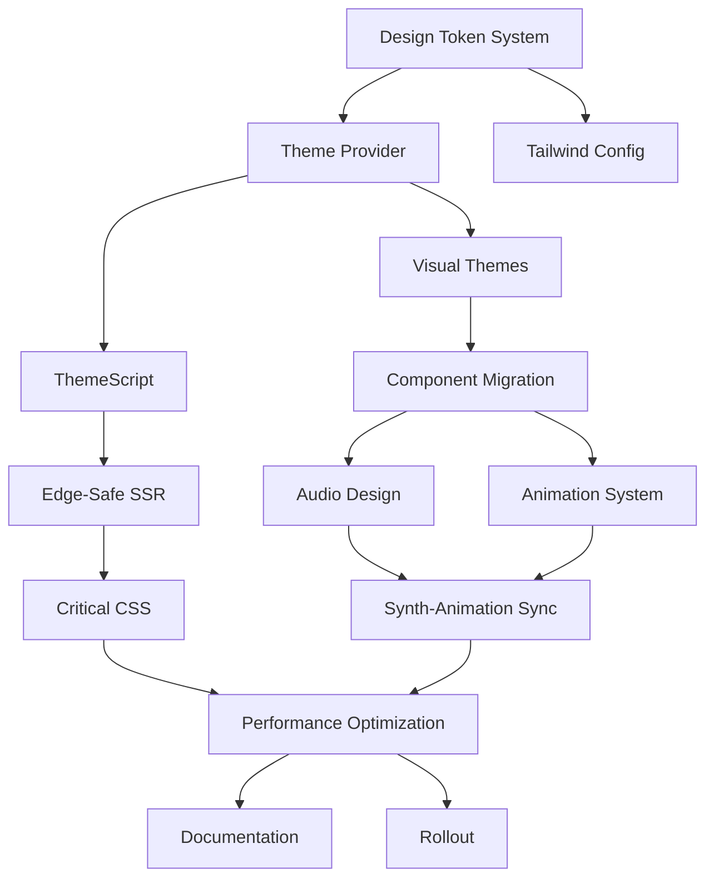

# Theming System Implementation Roadmap

This document provides a high-level roadmap for implementing the new theming system in the DIY Recipes application. It ties together the detailed implementation guides and establishes a coordinated approach for the team to follow.

## Overview

The new theming system will transform our current implementation into a more robust, maintainable, and feature-rich solution. The system consists of several interconnected components:

1. **Design Token System**: A structured approach to defining and using design tokens
2. **Theme Provider**: Enhanced mechanism for theme switching and preference management
3. **Visual Themes**: Three distinct theme options with comprehensive styling
4. **Audio Design**: Synth-based sound effects tied to UI interactions
5. **Animation System**: Cohesive animations that respect user preferences
6. **Edge-Safe SSR**: Techniques to prevent Flash of Unstyled Content

## Implementation Phases

### Phase 1: Foundation (Weeks 1-2)

**Goal**: Establish the core token system and provider mechanism

**Tasks**:
- Create the token taxonomy and CSS variable structure
- Convert color values to RGB triplets
- Update Tailwind configuration
- Enhance the SettingsProvider
- Implement ThemeScript for FOUC prevention
- Create theme toggle component

**Key Deliverables**:
- `tokens.css` with primitive and semantic tokens
- Updated `tailwind.config.ts`
- Enhanced `SettingsProvider.tsx`
- `ThemeScript.tsx` component

**Team Members**:
- Frontend Lead: Token system architecture
- UI Developer: CSS implementation
- React Developer: Provider enhancement

**Reference Documents**:
- [Theming Implementation Plan](./theming-implementation-plan.md)
- [Tokens Sample Implementation](./tokens-sample-implementation.md)
- [Edge-Safe SSR Implementation](./edge-safe-ssr-implementation.md)

### Phase 2: Visual Themes (Weeks 2-3)

**Goal**: Implement the three visual themes with comprehensive styling

**Tasks**:
- Define theme palettes (Synthwave Noir, Terminal Mono, Paper Ledger)
- Create theme-specific component variants
- Implement theme background effects
- Migrate existing components to use the new token system

**Key Deliverables**:
- Theme-specific CSS for each theme
- Updated component library using semantic tokens
- Background and special effects for each theme

**Team Members**:
- UI Designer: Theme palette definition
- Frontend Developers: Component migration
- CSS Specialist: Special effects implementation

**Reference Documents**:
- [Theme Migration Mapping](./theme-migration-mapping.md)
- [Tokens Sample Implementation](./tokens-sample-implementation.md)

### Phase 3: Audio & Animation (Weeks 3-4)

**Goal**: Implement the audio design system and animation system

**Tasks**:
- Create core audio module with Web Audio API
- Implement synth patches for UI events
- Define animation variants and keyframes
- Connect animations to theme system
- Implement synth-animation synchronization

**Key Deliverables**:
- Audio core module and synth patches
- Animation variants and CSS keyframes
- Hooks for synth-animation synchronization

**Team Members**:
- Audio Engineer: Synth patch implementation
- Animation Specialist: Animation system implementation
- React Developer: Hooks and integration

**Reference Documents**:
- [Audio Design Implementation](./audio-design-implementation.md)
- [Animation System Implementation](./animation-system-implementation.md)

### Phase 4: Optimization & Testing (Weeks 4-5)

**Goal**: Optimize performance and ensure accessibility

**Tasks**:
- Extract and inline critical CSS
- Implement deferred loading of non-critical CSS
- Add preloading of theme-specific assets
- Implement comprehensive accessibility features
- Conduct performance testing and optimization

**Key Deliverables**:
- Critical CSS extraction script
- Optimized asset loading strategy
- Accessibility features for reduced motion/sound
- Performance test results and optimizations

**Team Members**:
- Performance Engineer: Critical CSS and optimization
- Accessibility Specialist: Reduced motion implementation
- QA Team: Testing and validation

**Reference Documents**:
- [Edge-Safe SSR Implementation](./edge-safe-ssr-implementation.md)
- [Animation System Implementation](./animation-system-implementation.md)
- [Audio Design Implementation](./audio-design-implementation.md)

### Phase 5: Documentation & Rollout (Weeks 5-6)

**Goal**: Document the system and roll out to users

**Tasks**:
- Create comprehensive documentation
- Develop theme showcase
- Implement A/B testing strategy
- Roll out to users with feature flags

**Key Deliverables**:
- Theme system documentation
- Theme showcase component
- A/B testing results
- Gradual rollout plan

**Team Members**:
- Technical Writer: Documentation
- UI Developer: Theme showcase
- Product Manager: Rollout strategy

## Dependency Graph

## Risk Assessment

| Risk | Impact | Likelihood | Mitigation |
|------|--------|------------|------------|
| FOUC during theme switching | Medium | High | Implement ThemeScript, critical CSS |
| Performance degradation | High | Medium | Optimize animations, defer non-critical CSS |
| Accessibility issues | High | Medium | Implement reduced motion/sound detection |
| Browser compatibility | Medium | Medium | Test across browsers, implement fallbacks |
| Migration complexity | Medium | High | Use theme mapping, gradual component migration |

## Testing Strategy

### Unit Tests
- Token generation and application
- Theme detection and switching
- Audio synthesis functions
- Animation variants

### Integration Tests
- Theme switching with audio/animation
- SSR with theme detection
- Component theming across themes

### Visual Regression Tests
- Component appearance in each theme
- Animation sequences
- Theme transitions

### Accessibility Tests
- Reduced motion preference
- Keyboard navigation with audio feedback
- Screen reader compatibility

### Performance Tests
- Initial load time with SSR
- Animation frame rate
- Memory usage during theme switching

## Backward Compatibility

To ensure a smooth transition, we'll implement:

1. **Theme Mapping**: Map old theme names to new ones
2. **CSS Compatibility Layer**: Maintain old CSS variables alongside new ones
3. **Feature Flags**: Allow gradual rollout of new features
4. **Component-by-Component Migration**: Migrate components incrementally

See the [Theme Migration Mapping](./theme-migration-mapping.md) document for detailed mapping between old and new themes.

## Success Metrics

We'll measure the success of the new theming system by:

1. **Performance Metrics**:
   - First Contentful Paint (FCP) < 1.8s
   - Cumulative Layout Shift (CLS) < 0.1
   - Time to Interactive (TTI) < 3.5s

2. **User Engagement**:
   - Theme switching rate
   - Time spent in each theme
   - User feedback ratings

3. **Developer Experience**:
   - Component development time
   - Theme-related bug rate
   - Code maintainability metrics

## Next Steps

1. **Kickoff Meeting**: Review this roadmap with the team
2. **Sprint Planning**: Allocate tasks for Phase 1
3. **Prototype Development**: Create a minimal prototype with the token system
4. **Review Cycle**: Establish regular review points for each phase

## Resources

- [Theming Implementation Plan](./theming-implementation-plan.md): Comprehensive implementation plan
- [Tokens Sample Implementation](./tokens-sample-implementation.md): Example token structure
- [Theme Migration Mapping](./theme-migration-mapping.md): Mapping between old and new themes
- [Audio Design Implementation](./audio-design-implementation.md): Audio system implementation
- [Animation System Implementation](./animation-system-implementation.md): Animation system implementation
- [Edge-Safe SSR Implementation](./edge-safe-ssr-implementation.md): SSR optimization techniques

## Conclusion

This roadmap provides a structured approach to implementing the new theming system. By following this plan, we can ensure a coordinated effort that delivers a high-quality, performant, and accessible theming experience for our users.

The implementation is designed to be incremental, allowing for continuous delivery of improvements while maintaining backward compatibility. Regular reviews and adjustments to the plan will ensure we stay on track and address any challenges that arise during implementation.